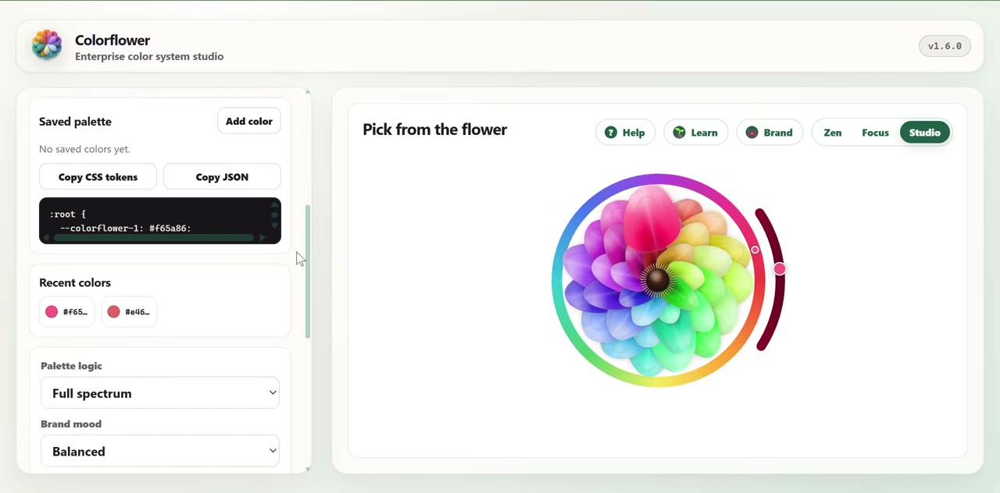
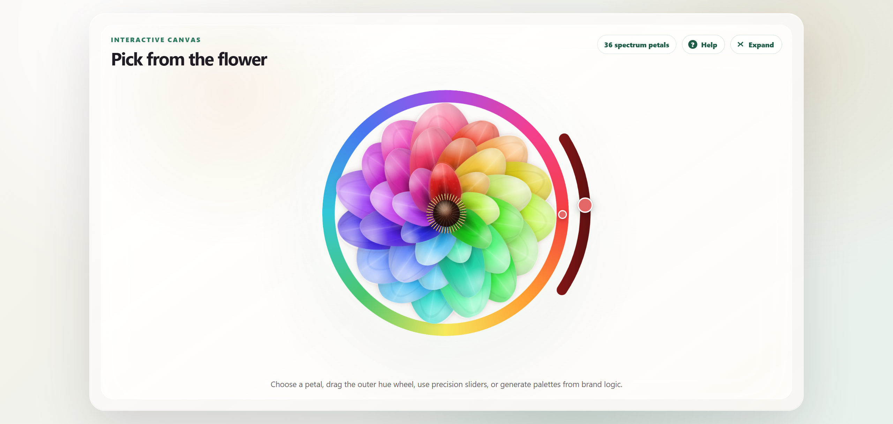
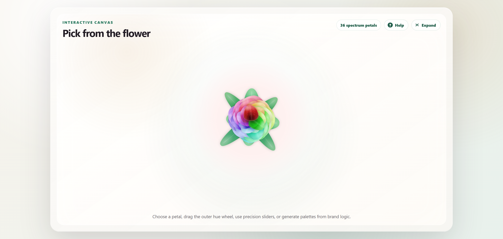

# Colorflower

Colorflower is a flower-native color system studio. Instead of a rectangular
picker, colors live on an animated, three-dimensional flower — pick from the
petals, refine with precision controls, generate harmonious palettes, check
contrast, and copy production-ready tokens.

[](https://github.com/AIimagined/colorflower/raw/main/assets/media/colorflower-demo.mp4)

<p align="center"><em>▶ Click the image above to watch the 30-second demo.</em></p>

## About

Colorflower turns color selection into a visual design workflow. Each petal is a
selectable color on a living flower that drifts gently in space, leans toward
your cursor like it is catching a breeze, and whose petals cup forward in real
CSS 3D. Click the flower's center (the pistil) and it slowly folds into a leafy
bud; click again and it blooms back open.

It is a dependency-free static web app — no build step — so it runs locally, can
be hosted as a static site, or loaded as a browser extension.

## Features

### Pick & refine
- Animated flower picker with **36 spectrum petals**.
- Real **3D depth**: petals cup forward, the flower idly **floats**, leans into a
  pointer-driven **breeze**, and petals lift and sway away from the cursor.
- Outer **hue wheel** and a thick **shade arc** (light → dark) with a live handle.
- Precision **hue**, **saturation**, and **bloom-speed** controls.
- Botanical **pistil** (stigmatic disc + stamens). Click it to **fold the flower
  into a bud** wrapped in green sepal leaves — click again to bloom.

### Palettes & output
- Harmony modes: spectrum, complementary, triadic, analogous, monochrome,
  split-complementary (plus tetradic and square via the API/MCP).
- Brand mood presets: balanced, luxury, calm, playful, clinical, editorial,
  nature.
- Lockable hue, saturation, and lightness channels.
- **HEX, RGB, HSL, OKLCH, OKLab** outputs and generated color names.
- WCAG contrast helper and A/B color compare.
- Saved **bouquet** with removable chips, **CSS custom-property** export,
  **JSON** export, recent history.
- **Image-to-flower** palette extraction from an uploaded photo.

### Color science
- **Spectral pigment mixing** (Kubelka-Munk) — mix colors like paint, not
  like RGB averages.
- **10-step tint/shade ramps** and dark-background palette derivation.
- **Brand kit generator** — pick a seed on a miniature flower and get a full
  light/dark semantic token theme with a WCAG contrast audit built in.
- **Brand color lookup** — search a bundled dataset of ~700 brands, or find
  the nearest brands to any color by perceptual (ΔE) distance.
- **Learn** — an in-app, interactive color-theory primer (mixing, harmony,
  contrast, color spaces, and more).

### Experience
- **Three layout densities** — **Zen** (just a swatch, sliders, and copy),
  **Focus** (flower alone, panels collapsed), and **Studio** (the full
  toolkit). One click to switch; your choice is remembered.
- Single-screen layout — the studio fits the viewport without page scrolling,
  and the flower scales itself to the space available.
- In-app help panel and per-control tooltips.
- Smooth **60 fps** rendering; respects `prefers-reduced-motion`.

<p align="center">
  
  
</p>

## Quick start

Run a local static server from the project root:

```powershell
python -m http.server 4173
```

Open <http://127.0.0.1:4173/index.html>.

## Browser extension

A Chrome / Edge extension is included. Build and load it:

```powershell
python tools/build_extension.py
```

Then in `chrome://extensions` enable **Developer mode** → **Load unpacked** →
select the `extension/` folder. Click the flower toolbar icon to open the studio.

## Developer & agent integrations

The color engine is available beyond the UI:

- **Color engine module** — `core/color-engine.js`, a pure ES module
  (conversion, palettes/harmony, contrast, naming, ΔE, spectral mixing,
  tint/shade ramps, dark-palette derivation, brand lookup, full theme
  generation). Tested with `node --test core/color-engine.test.js`.
- **REST API** — `node api/server.js` exposes the whole engine over HTTP
  (`/convert`, `/palette`, `/contrast`, `/theme`, `/mix`, `/brand`, … plus an
  OpenAPI 3.1 spec for function-calling agents). See
  [`api/README.md`](./api/README.md).
- **MCP server** — `mcp/` exposes the engine as 14 Model Context Protocol
  tools and 2 prompts for AI agents and assistants. See
  [`mcp/README.md`](./mcp/README.md) and [`docs/AGENTS.md`](./docs/AGENTS.md).
- **Taste skill** — [`skills/colorflower-taste/SKILL.md`](./skills/colorflower-taste/SKILL.md)
  encodes the judgment layer (which harmony fits which mood, contrast gates,
  dark-mode rules) as a portable agent skill, and
  [`DESIGN.md`](./DESIGN.md) documents Colorflower's own design tokens.

## Documentation

- [User guide](./docs/USER-GUIDE.md)
- [Agent integration](./docs/AGENTS.md)

## Project structure

```text
.
├── assets/
│   ├── icons/          app icon & favicons
│   └── screenshots/
├── core/               shared color engine + tests
├── api/                REST API
├── mcp/                MCP server
├── extension/          built Chrome/Edge extension
├── src/                web app (picker, Learn, Brand kit, styles)
├── data/               curated brand-color overrides
├── vendor/             vendored third-party libs (see vendor/NOTICE.md)
├── skills/             portable agent skill (color taste)
├── docs/               user guide & agent integration
├── tools/              build scripts (icons, extension)
├── index.html
├── site.webmanifest
├── DESIGN.md           design-language token reference
├── LICENSE
└── README.md
```

## License

MIT License. See [LICENSE](./LICENSE).
