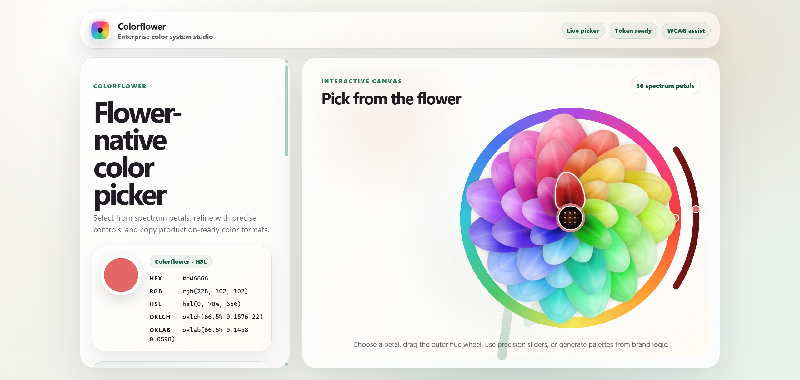
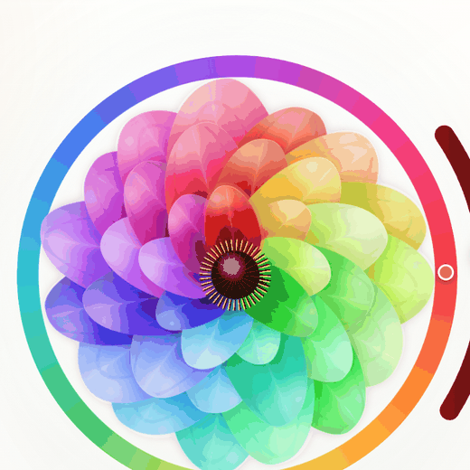

# Colorflower

Colorflower is a flower-native color system studio. Instead of a rectangular
picker, colors live on an animated, three-dimensional flower — pick from the
petals, refine with precision controls, generate harmonious palettes, check
contrast, and copy production-ready tokens.



<p align="center">
  
</p>

## About

Colorflower turns color selection into a visual design workflow. Each petal is a
selectable color on a living flower that drifts gently in space, leans toward
your cursor like it is catching a breeze, and whose petals cup forward in real
CSS 3D. Click the flower's center (the pistil) and it slowly folds into a leafy
bud; click again and it blooms back open.

It is a dependency-free static web app — no build step — so it runs locally, can
be hosted as a static site, or loaded as a browser extension.

## Features

### Pick & refine
- Animated flower picker with **36 spectrum petals**.
- Real **3D depth**: petals cup forward, the flower idly **floats**, leans into a
  pointer-driven **breeze**, and petals lift and sway away from the cursor.
- Outer **hue wheel** and a thick **shade arc** (light → dark) with a live handle.
- Precision **hue**, **saturation**, and **bloom-speed** controls.
- Botanical **pistil** (stigmatic disc + stamens). Click it to **fold the flower
  into a bud** wrapped in green sepal leaves — click again to bloom.

### Palettes & output
- Harmony modes: spectrum, complementary, triadic, analogous, monochrome,
  split-complementary.
- Brand mood presets: balanced, luxury, calm, playful, clinical, editorial,
  nature.
- Lockable hue, saturation, and lightness channels.
- **HEX, RGB, HSL, OKLCH, OKLab** outputs and generated color names.
- WCAG contrast helper and A/B color compare.
- Saved **bouquet**, **CSS custom-property** export, **JSON** export, recent
  history.
- **Image-to-flower** palette extraction from an uploaded photo.

### Experience
- **Focus mode** — collapse the panels and top bar so the flower canvas is
  centered; expand to return to the full studio.
- In-app help panel and per-control tooltips.
- Smooth **60 fps** rendering; respects `prefers-reduced-motion`.

<p align="center">
  
  
</p>

## Quick start

Run a local static server from the project root:

```powershell
python -m http.server 4173
```

Open <http://127.0.0.1:4173/index.html>.

## Browser extension

A Chrome / Edge extension is included. Build and load it:

```powershell
python tools/build_extension.py
```

Then in `chrome://extensions` enable **Developer mode** → **Load unpacked** →
select the `extension/` folder. Click the flower toolbar icon to open the studio.
See [`extension/README.md`](./extension/README.md).

## Developer & agent integrations

The color engine is available beyond the UI:

- **Color engine module** — `core/color-engine.js`, a pure, dependency-free ES
  module (conversion, palette/harmony, contrast, naming).
- **REST API** — `node api/server.js` exposes `/convert`, `/palette`,
  `/contrast`, `/name`, `/tokens` (plus an OpenAPI spec). See
  [`api/README.md`](./api/README.md).
- **MCP server** — `mcp/` exposes the engine as Model Context Protocol tools for
  AI agents and assistants. See [`mcp/README.md`](./mcp/README.md) and
  [`docs/AGENTS.md`](./docs/AGENTS.md).

## Documentation

- [User guide](./docs/USER-GUIDE.md)
- [Agent integration](./docs/AGENTS.md)

## Project structure

```text
.
├── assets/
│   ├── icons/          app icon & favicons
│   └── screenshots/
├── core/               shared color engine
├── api/                REST API
├── mcp/                MCP server
├── extension/          built Chrome/Edge extension
├── src/
│   ├── app.js
│   └── styles.css
├── tools/              build scripts (icons, extension)
├── index.html
├── site.webmanifest
├── LICENSE
└── README.md
```

## License

MIT License. See [LICENSE](./LICENSE).
